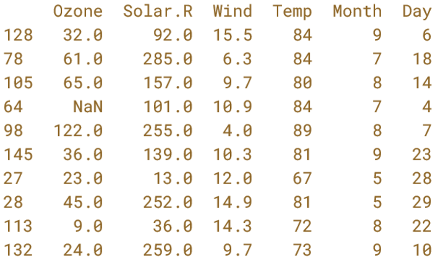

# Assignment 1: Pipes, Filters, and Finding Things

## Reading for Discussion Next lecture

[Wilson_etal_2017_good_enough_practices](../literature/Wilson_etal_2017_good_enough_practices_in_scientific_computing.pdf)

[Complete these questions about the reading](https://forms.cloud.microsoft/r/deB63CDLgD)

---

## Computer Preparation

Complete the [Computer Setup Checklist](../resources/computer_setup_checklist.md) which should have already been completed in the first lecture.

---

## Description of Assignment

We are going to flip the classroom again next week. Flipping the classroom means that you work on the material to be covered before we address it in lecture. Then we can spend time in lecture going over the most challenging topics, as identified by you. Then we will continue together in lecture through new material that builds upon this assignment.  This material is covered in ch 1.6 of the CSB book.

In Assignment 0, you learned how to navigate directories and work with files from the command line.

In this assignment, you will build on those skills by learning how to:

* redirect command output,
* connect commands using pipes,
* search inside files with `grep`,
* find files with `find`,
* process tabular data with commands such as `cut`, `sort`, and `uniq`,
* combine several commands to solve larger problems, and
* submit your work using Git.

You will work **entirely inside a local clone of this Assignment 1 repository**.

Keep this `README.md` open in your web browser on GitHub while working through the assignment in your terminal.

---

<details><summary><strong>1. Clone Your Assignment Repository</strong></summary>

## Clone Your Assignment Repository

When you accepted this GitHub Classroom assignment, GitHub created your own Assignment 1 repository.

On the GitHub webpage for **your Assignment 1 repository**:

1. Click the green **Code** button.
2. Select **SSH**.
3. Copy the SSH address.

In your terminal, go to your home directory:

```bash
cd ~
```

Clone your repository, giving the local clone the name `assignment-1`:

```text
git clone YOUR-COPIED-SSH-ADDRESS assignment-1
```

Enter the repository:

```bash
cd assignment-1
```

Check your location:

```bash
pwd
```

Your path should end with:

```text
/assignment-1
```

List the contents:

```bash
ls
```

You should see at least:

```text
README.md
shell-lesson-data
CSB
```

From this point forward, all of your work will remain inside the `assignment-1` repository.

</details>

---

<details>
<summary><strong>2. Pipes and Filters</strong></summary>

## Pipes and Filters

One of the most powerful features of Bash is the ability to combine small commands.

Instead of using one large program to perform an entire task, we can connect commands that each perform one simple job.

Enter the `exercise-data` directory:

```bash
cd shell-lesson-data/exercise-data
```

Look at the directory contents:

```bash
ls
```

You should see directories including:

```text
alkanes
animal-counts
creatures
writing
```

### Count lines with `wc`

Enter the `alkanes` directory:

```bash
cd alkanes
```

The directory contains several `.pdb` files.

Count the number of lines in one file:

```bash
wc -l cubane.pdb
```

Now count the lines in every `.pdb` file:

```bash
wc -l *.pdb
```

The `*` is a wildcard that matches any sequence of characters.

Therefore:

```text
*.pdb
```

matches every filename ending in `.pdb`.

---

### Redirect output with `>`

Normally, output is printed to the terminal.

You can instead redirect the output to a file:

```bash
wc -l *.pdb > lengths.txt
```

Display the new file:

```bash
cat lengths.txt
```

The general form is:

```text
command > filename
```

> ⚠️ **CAUTION:** `>` replaces the contents of the output file if the file already exists.

To **append** output to an existing file instead, use:

```text
>>
```

For example:

```bash
echo "another line" >> lengths.txt
```

---

### Sort output

Run:

```bash
sort lengths.txt
```

By default, `sort` sorts alphabetically.

To sort numerically:

```bash
sort -n lengths.txt
```

You can also use `head` to show only the beginning of the output:

```bash
sort -n lengths.txt | head
```

The vertical bar:

```text
|
```

is called a **pipe**.

A pipe passes the output of the command on the left to the input of the command on the right.

You can therefore do everything above without creating `lengths.txt`:

```bash
wc -l *.pdb | sort -n | head
```

You can connect more than two commands in a pipeline.

For example, show the three `.pdb` files with the fewest lines:

```bash
wc -l *.pdb | sort -n | head -n 3
```

Remove the temporary file:

```bash
rm lengths.txt
```

### Key idea

Read pipelines from **left to right**.

For:

```bash
wc -l *.pdb | sort -n | head -n 3
```

Bash:

1. counts the lines,
2. sends those results to `sort`,
3. sorts them numerically,
4. sends the sorted results to `head`,
5. displays the first three lines.

</details>

---

<details>
<summary><strong>3. Finding Things</strong></summary>

## Finding Things

There are two different kinds of searching that you will commonly perform at the command line:

* `grep` searches **inside files**.
* `find` searches for **files and directories**.

Return to `exercise-data`:

```bash
cd ~/assignment-1/shell-lesson-data/exercise-data
```

---

### Search inside files with `grep`

Enter the `writing` directory:

```bash
cd writing
```

Display the haiku:

```bash
cat haiku.txt
```

Search for lines containing the word `not`:

```bash
grep "not" haiku.txt
```

The general form is:

```text
grep "PATTERN" filename
```

To also show the line number:

```bash
grep -n "not" haiku.txt
```

To ignore capitalization:

```bash
grep -i "the" haiku.txt
```

Options can usually be combined:

```bash
grep -ni "the" haiku.txt
```

You can also search several files at once:

```bash
grep -n "the" *.txt
```

---

### Find files with `find`

Return to `exercise-data`:

```bash
cd ..
```

Find everything below your current directory:

```bash
find .
```

Remember that:

```text
.
```

means the current directory.

Find only files:

```bash
find . -type f
```

Find only directories:

```bash
find . -type d
```

Find all files ending in `.txt`:

```bash
find . -type f -name "*.txt"
```

Find all `.pdb` files:

```bash
find . -type f -name "*.pdb"
```

> 💡 **TIP:** Put `"*.txt"` or similar patterns in quotes when using `find`. This allows `find` rather than Bash to interpret the wildcard.

---

### Combine `find` with a pipe

You can pipe the output of `find` into another command.

For example, count how many files occur below `exercise-data`:

```bash
find . -type f | wc -l
```

Or count how many `.pdb` files there are:

```bash
find . -type f -name "*.pdb" | wc -l
```

This is where the command line becomes particularly useful: simple commands can be combined to answer questions that none of the individual commands answers by itself.

</details>

---

<details>
<summary><strong>4. Advanced `bash` Commands Using the CSB Data</strong></summary>

## Advanced `bash` Commands

The Assignment 1 repository also contains the `CSB` directory used by the *Computing Skills for Biologists* materials.

Return to the root of your Assignment 1 repository:

```bash
cd ~/assignment-1
```

Move into the `sandbox` directory:

```bash
cd CSB/unix/sandbox
pwd
```

Your current directory should now be `sandbox`.

The relevant directory structure is:

```text
CSB/unix
├── data
│   ├── Saavedra2013
│   └── miRNA
├── installation
├── sandbox        # YOU SHOULD BE HERE!
└── solutions
```

---

### Redirection of output

Redirect standard output to a file with: `command > filename`

Append standard output to a file with: `command >> filename`

For example:

```bash
# print text to the screen
echo "My first line"
```

Output:

```text
My first line
```

Now redirect it to a file:

```bash
echo "My first line" > test.txt
cat test.txt
```

Output:

```text
My first line
```

Append another line:

```bash
echo "My second line" >> test.txt
cat test.txt
```

Output:

```text
My first line
My second line
```

💡 **TIP:** Use the **Tab** key to autocomplete file and directory names. This helps prevent spelling mistakes.

---

### Problem Solving Scenario

Imagine that a machine provides you with thousands of data files. There are so many files that trying to view them in the graphical file browser causes the computer to freeze.

How could you determine the number of files without opening the directory in a graphical interface?

We will use:

```text
CSB/unix/data/Saavedra2013
```

as an example of a directory containing many files.

You are currently here:

```text
CSB/unix
├── data
│   ├── Saavedra2013
│   └── miRNA
├── installation
├── sandbox        # YOU ARE HERE!
└── solutions
```

From `sandbox`, the relative path to `Saavedra2013` is:

```text
../data/Saavedra2013
```

Save the filenames to a file:

```bash
ls ../data/Saavedra2013 > filelist.txt
```

Look at the file:

```bash
cat filelist.txt
```

Count the number of lines:

```bash
wc -l filelist.txt
```

Because `ls` placed one filename on each line, the number of lines is also the number of files.

Remove the temporary file:

```bash
rm filelist.txt
```

---

### Piping Text Streams From One Command to the Next with `|`


A pipe, `|`, passes the standard output from one command to the standard input of another.

❓ **QUESTION:** How many files are there in `CSB/unix/data/Saavedra2013`?

First list the filenames:

```bash
ls ../data/Saavedra2013
```

Now pipe that output directly into `wc`:

```bash
ls ../data/Saavedra2013 | wc -l
```

This eliminates the need to create `filelist.txt`.

---

### TSV and CSV Data Files
In the tidy table below, columns are delimited by tabs. The first column has no column header but is the sample ID. Ozone, Solar.R, Wind, Temp, Month, and Day are all pieces of data (dimensions) describing each of the 10 samples.



In a **tab-separated values (TSV)** file, columns are separated by tabs.

In a **comma-separated values (CSV)** file, columns are separated by commas.

A tidy dataset has:

* one observation per row,
* one variable per column, and
* one value per cell.

Example tidy table:

| Column 1 Header | Column 2 Header | Column 3 Header |
| --------------- | --------------- | --------------- |
| Row 1 Column 1  | Row 1 Column 2  | Row 1 Column 3  |
| Row 2 Column 1  | Row 2 Column 2  | Row 2 Column 3  |
| Row 3 Column 1  | Row 3 Column 2  | Row 3 Column 3  |

TSV:

```text
Column 1 Header	Column 2 Header	Column 3 Header
Row 1 Column 1	Row 1 Column 2	Row 1 Column 3
Row 2 Column 1	Row 2 Column 2	Row 2 Column 3
```

CSV:

```text
Column 1 Header,Column 2 Header,Column 3 Header
Row 1 Column 1,Row 1 Column 2,Row 1 Column 3
Row 2 Column 1,Row 2 Column 2,Row 2 Column 3
```

> ⚠️ **CAUTION:** File extensions are not always reliable. It is important to inspect a file to determine what delimiter it actually uses.

The expression:

```text
\t
```

is commonly used to represent a **tab character**.

The backslash `\` changes the meaning of the character that follows it. You will encounter this kind of notation frequently when working with text and regular expressions.

---

### Convert Among Formats Using `tr`

Move into the CSB data directory:

```bash
cd ../data
```

View the `Pacifici2013_data.csv` file:

```bash
less -S Pacifici2013_data.csv
```

Press `q` to leave `less`.

Although the filename ends in `.csv`, this file uses semicolons as delimiters.

Replace semicolons with commas:

```bash
cat Pacifici2013_data.csv | tr ";" "," | less -S
```

View the same data as tab-separated text:

```bash
cat Pacifici2013_data.csv | tr ";" "\t" | less -S
```

💡 `tr` is an abbreviation for **translate**.

---

### Using `cut` to Retrieve Columns

Display the first line of the file:

```bash
head -n 1 Pacifici2013_data.csv
```

Display the first column:

```bash
cut -d ";" -f 1 Pacifici2013_data.csv
```

Display columns two through four:

```bash
cut -d ";" -f 2-4 Pacifici2013_data.csv
```

Display the first field of the first row:

```bash
head -n 1 Pacifici2013_data.csv | cut -d ";" -f 1
```

The options used above are:

```text
-d   specify the delimiter
-f   specify the field or fields to return
```

💡 `cut` assumes tab-delimited input unless another delimiter is specified with `-d`.

---

### Connecting `cut`, `head`, `tail`, `sort`, and `uniq`

Select the second column and display the first five lines:

```bash
cut -d ";" -f 2 Pacifici2013_data.csv | head -n 5
```

Select the second and eighth columns and display the first three lines:

```bash
cut -d ";" -f 2,8 Pacifici2013_data.csv | head -n 3
```

Select the second column, remove the header, and display the first five records:

```bash
cut -d ";" -f 2 Pacifici2013_data.csv | tail -n +2 | head -n 5
```

Identify the unique orders represented in the dataset:

```bash
cut -d ";" -f 2 Pacifici2013_data.csv | tail -n +2 | sort | uniq
```

Count how many records belong to each order:

```bash
cut -d ";" -f 2 Pacifici2013_data.csv | tail -n +2 | sort | uniq -c
```

`uniq` removes consecutive duplicate lines.

For that reason, input to `uniq` is usually sorted first:

```text
sort | uniq
```

The `-c` option tells `uniq` to count the number of occurrences.

Use:

```bash
man uniq
```

to see the documentation for this command.

---

### Which Order Has the Most Records?

We can extend the previous pipeline to determine which order has the largest number of records:

```bash
cut -d ";" -f 2 Pacifici2013_data.csv | tail -n +2 | sort | uniq -c | tr -s " " "\t" | cut -f 2-3 | sort -n | tail -n 1
```

That is a long command.

Do **not** try to construct complicated pipelines all at once.

Build them one step at a time and examine the output after each step.

Start with:

```bash
cut -d ";" -f 2 Pacifici2013_data.csv | less -S
```

Add removal of the header:

```bash
cut -d ";" -f 2 Pacifici2013_data.csv | tail -n +2 | head
```

Add sorting:

```bash
cut -d ";" -f 2 Pacifici2013_data.csv | tail -n +2 | sort | head
```

Count the unique values:

```bash
cut -d ";" -f 2 Pacifici2013_data.csv | tail -n +2 | sort | uniq -c | less -S
```

Convert repeated spaces in the output to a single tab:

```bash
cut -d ";" -f 2 Pacifici2013_data.csv | tail -n +2 | sort | uniq -c | tr -s " " "\t" | head
```

Select the fields we want:

```bash
cut -d ";" -f 2 Pacifici2013_data.csv | tail -n +2 | sort | uniq -c | tr -s " " "\t" | cut -f 2-3 | head
```

Sort numerically:

```bash
cut -d ";" -f 2 Pacifici2013_data.csv | tail -n +2 | sort | uniq -c | tr -s " " "\t" | cut -f 2-3 | sort -n | less -S
```

Finally, return the order with the most records:

```bash
cut -d ";" -f 2 Pacifici2013_data.csv | tail -n +2 | sort | uniq -c | tr -s " " "\t" | cut -f 2-3 | sort -n | tail -n 1
```

### Key idea

When constructing a long pipeline:

1. start with the first command,
2. inspect its output,
3. add one command,
4. inspect the new output,
5. continue until the pipeline produces the result you want.

This is much easier to troubleshoot than writing the entire pipeline at once.

</details>

---

<details><summary><strong>5. Mind Expander 01.03</strong></summary>
<p>

[Mind Expander 1.3 Form](https://forms.office.com/Pages/ResponsePage.aspx?id=8frLNKZngUepylFOslULZlFZdbyVx8RLiPt1GobhHnlUOThBNjZNVzlGQUtJUzhYREZVSE5UVVJMNS4u)

</p>
</details>

---

<details><summary><strong>6. Exercise 1.10.1</strong></summary>
<p>

Complete [Exercise 1.10.1 Next Generation Sequencing Data](https://forms.office.com/Pages/ResponsePage.aspx?id=8frLNKZngUepylFOslULZlFZdbyVx8RLiPt1GobhHnlUMTVENFg0UjhFTzc3Wkc0NExRTjdLSjdGNi4u) using the commands you've learned and the `grep` command. Please consult the [Unix/Linux Cheat Sheet](https://github.com/tamucc-comp-bio/classroom_repo_2026/blob/main/resources/CheatSheetLinux_2022-09-02.pdf). Make sure that you document your work by saving your answers for each question in a text document (use notepad++  or bbedit).  Then when done, copy and paste your answers into the form and submit.  We will review this in class

</p>
</details>

---


<details>
<summary><strong>7. Submit Your Work</strong></summary>

## Submit Your Work

Return to the root of the Assignment 1 repository:

```bash
cd ~/assignment-1
```

Confirm:

```bash
pwd
```

Your path should end with:

```text
/assignment-1
```

Check what changed:

```bash
git status
```

You should see the files that you created or modified while completing the assignment.

Stage your changes:

```bash
git add --all
```

Check again:

```bash
git status
```

Commit your work:

```bash
git commit -m "Complete Assignment 1"
```

Push the commit to GitHub:

```bash
git push
```

Return to your Assignment 1 repository in your web browser and refresh the page.

Confirm that your changes appear on GitHub.

> **Your work is not submitted until it has been committed and pushed to GitHub.**

</details>

---

## Commands Introduced or Used in This Assignment

| Command or operator | Purpose                                   |
| ------------------- | ----------------------------------------- |
| `wc -l`             | count lines                               |
| `>`                 | redirect output to a file                 |
| `>>`                | append output to a file                   |
| `\|`                | pipe output from one command into another |
| `sort`              | sort lines                                |
| `sort -n`           | sort numerically                          |
| `head`              | display lines from the beginning          |
| `tail`              | display lines from the end                |
| `grep`              | search inside files                       |
| `find`              | find files and directories                |
| `tr`                | translate or replace characters           |
| `cut`               | select fields or columns                  |
| `uniq`              | remove consecutive duplicate lines        |
| `uniq -c`           | count consecutive duplicate lines         |
| `less -S`           | view text without wrapping long lines     |

---

## Source and Attribution

The introductory shell exercises in this assignment are adapted from concepts and example data used in **The Carpentries: The Unix Shell**.

The Carpentries instructional materials are licensed under the Creative Commons Attribution 4.0 International license.

* [The Unix Shell: Pipes and Filters](https://swcarpentry.github.io/shell-novice/04-pipefilter.html)
* [The Unix Shell: Finding Things](https://swcarpentry.github.io/shell-novice/07-find.html)

The `CSB` data and examples are from *Computing Skills for Biologists*.

---


